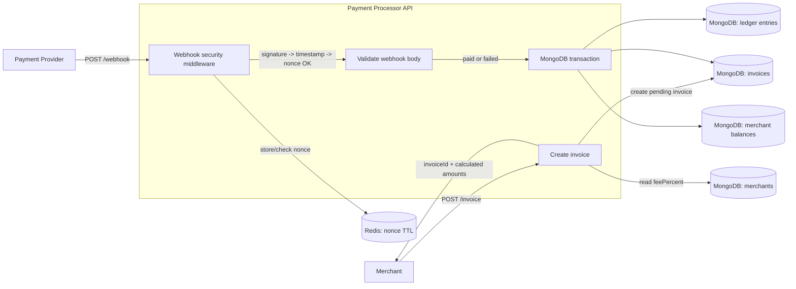
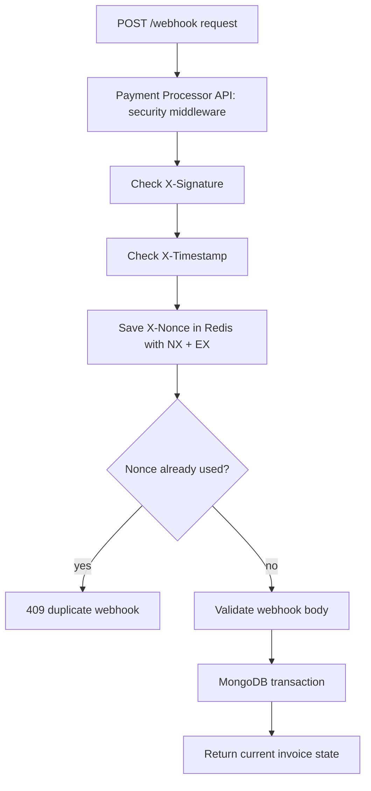

# Payment Processor

A small Express.js API for merchant invoices and signed payment webhooks. It calculates fees, stores pending invoices, and records a merchant credit exactly once when the payment provider confirms that an invoice was paid.

## What's Inside

- Node.js + Express + TypeScript
- MongoDB + Mongoose
- Redis
- Decimal money calculations (Decimal.js)
- Swagger UI
- Jest — 100% statement, branch, function, and line coverage

## How It Works



Main flow:

1. The merchant calls `POST /invoice`.
2. The backend reads the merchant's `feePercent`.
3. It calculates `fee` and `amountToReceive`.
4. It stores the invoice with status `pending`.
5. The payment provider sends `POST /webhook` with status `paid` or `failed`.
6. Security middleware verifies the signature first, then checks timestamp and nonce.
7. The webhook body is validated only after security checks pass.
8. If the status is `paid`, the merchant balance is credited atomically inside a MongoDB transaction using `$inc`, so concurrent webhooks for different invoices from the same merchant never overwrite each other.

## Quick Start

Install dependencies and create your local environment file:

```bash
npm install
cp .env.example .env
```

Open `.env` and set the values for your local setup:

```env
NODE_ENV=development
HOST=0.0.0.0
PORT=3000
MONGO_URI=mongodb://localhost:27017/payment_processor?replicaSet=rs0
REDIS_URL=redis://localhost:6379
WEBHOOK_SECRET=change-me
WEBHOOK_TIMESTAMP_TOLERANCE_SECONDS=300
```

Use your own MongoDB and Redis URLs if they run somewhere else. The important parts are:

- `MONGO_URI` must point to a MongoDB replica set, because webhook processing uses MongoDB transactions.
- `REDIS_URL` must point to Redis, which stores webhook nonces for the replay window.
- `WEBHOOK_SECRET` is used to generate and verify webhook signatures. `change-me` is fine only for local testing.

Make sure MongoDB and Redis are running, then seed a test merchant and start the API:

```bash
npm run seed:merchant
npm run dev
```

The `npm run seed:merchant` command creates a test merchant named `merchant-1` with a `2.5%` fee. You can use it right away to test `POST /invoice` in Swagger.

After startup:

- API: `http://localhost:3000`
- Swagger UI: `http://localhost:3000/api-docs`
- OpenAPI JSON: `http://localhost:3000/openapi.json`
- Health check: `http://localhost:3000/health`


## API

### POST /invoice

Creates an invoice with status `pending`.

```bash
curl -X POST http://localhost:3000/invoice \
  -H "Content-Type: application/json" \
  -d '{"amount":"100.00","currency":"USD","merchantId":"merchant-1"}'
```

Example response:

```json
{
  "data": {
    "invoiceId": "665f6f1e8b3f3d49e57a6e11",
    "merchantId": "merchant-1",
    "amount": "100.00",
    "currency": "USD",
    "feePercent": "2.5",
    "fee": "2.50",
    "amountToReceive": "97.50",
    "status": "pending"
  }
}
```

### GET /invoice/:id

Returns the current invoice status and calculated amounts.

```bash
curl http://localhost:3000/invoice/665f6f1e8b3f3d49e57a6e11
```

### POST /webhook

Receives a payment status update from the payment provider.

Headers:

- `X-Signature` - HMAC-SHA256 of the raw JSON request body, optionally prefixed with `sha256=`.
- `X-Timestamp` - Unix timestamp in milliseconds or seconds. Must be within the tolerance window of the current time.
- `X-Nonce` - Unique delivery ID for this request (e.g. a UUID). Stored in Redis for the duration of the tolerance window to block replays.

Body:

```json
{
  "invoiceId": "665f6f1e8b3f3d49e57a6e11",
  "status": "paid"
}
```

#### How to test manually

Because webhooks are signed, you cannot simply send arbitrary JSON to this endpoint. You must generate valid `X-Signature`, `X-Timestamp`, and `X-Nonce` headers for your exact JSON body.

We provide a helper script to generate these automatically:

```bash
npm run webhook:headers -- <invoiceId> paid
```

**Testing via cURL**

The helper script will output a complete, ready-to-copy `curl` command. It looks like this:

```bash
curl -X POST http://localhost:3000/webhook \
  -H "Content-Type: application/json" \
  -H "X-Timestamp: 1735742400000" \
  -H "X-Nonce: 7f8a8b6d-3b6e-43d7-9b2a-7c20e21c5b41" \
  -H "X-Signature: sha256=8f5d..." \
  -d '{"invoiceId":"665f6f1e8b3f3d49e57a6e11","status":"paid"}'
```

Just run the output command in your terminal to simulate the payment provider.

**Testing via Swagger UI**

If you prefer testing through the UI (`http://localhost:3000/api-docs`):

1. Generate the headers using the helper script.
2. Open the `POST /webhook` endpoint in Swagger.
3. Paste the generated `X-Signature`, `X-Timestamp`, and `X-Nonce` values into their respective fields.
4. Paste the exact JSON body provided by the script into the request body field.

**Important:** The signature is tied to the exact JSON string. If you change any whitespace, the order of the fields, or the `invoiceId` in Swagger, the signature will become invalid. Always regenerate the headers if you modify the body.

## Webhook Security

The `/webhook` route runs security middleware before request body validation. This keeps unsigned traffic away from Zod validation and MongoDB work.



The protection has several layers:

- **HMAC** proves that the body was signed by a trusted payment provider.
- **Timestamp** limits the lifetime of a webhook request to the configured tolerance window (default: 300 seconds).
- **Nonce** is stored in Redis for the duration of the tolerance window and blocks repeated delivery of the same request.
- **Invoice status** check returns the current state if the invoice is already in the requested status, and rejects any attempt to transition away from a final status.
- **Unique ledger index** on `invoiceId` prevents a second credit record from being inserted even if the balance update is somehow retried.

## Money and Precision

`amount` is sent as a string, for example `"100.00"`. All intermediate calculations use `Decimal.js` with `ROUND_HALF_UP`, so there are no floating-point rounding errors.

MongoDB stores amounts in minor units (integer values):

| Field | Example value | Meaning |
|---|---|---|
| `Invoice.amountMinor` | `"10000"` | 100.00 USD |
| `Invoice.feeMinor` | `"250"` | 2.50 USD |
| `Invoice.amountToReceiveMinor` | `"9750"` | 97.50 USD |

Invoice minor-unit fields are stored as strings to avoid any risk of precision loss for very large values.

`MerchantBalance.amountMinor` is stored as a **Number**. This allows MongoDB's `$inc` operator to update the balance atomically in a single command, without a read-modify-write cycle. Minor-unit values for realistic payment amounts are well within JavaScript's `Number.MAX_SAFE_INTEGER` (~9×10¹⁵).

Invoice amounts above that safe minor-unit range are rejected before they can be stored or credited.

## Idempotency

A repeated webhook must not credit money twice. This project handles that in several layers:

- **Redis nonce** rejects any request that uses a nonce already seen within the tolerance window.
- **Invoice status check** — if an invoice is already in the requested status, the current state is returned without any writes.
- **Atomic `$inc` on merchant balance** — the balance is incremented in a single MongoDB command, so concurrent paid webhooks for different invoices from the same merchant always accumulate correctly and never overwrite each other.
- **Unique ledger index** on `invoiceId` — a second `LedgerEntry` for the same invoice cannot be inserted. If a duplicate key error (`code 11000`) is returned, the service reads and returns the current invoice state instead of failing.
- All three writes (invoice status, ledger entry, balance) happen inside a single MongoDB transaction, so the state is always consistent.

## Tests

```bash
npm run typecheck
npm test
```

`npm test` runs Jest with coverage. The coverage threshold is set to 100% for statements, branches, functions, and lines.

Tests cover:

- Fee calculation for USD (2 decimals), KWD (3 decimals), and JPY (0 decimals).
- Signature verification: valid, missing, tampered.
- Security middleware order: unsigned requests are rejected before body validation.
- Timestamp validation: fresh, stale, missing, non-numeric.
- Nonce deduplication via Redis.
- Invalid webhook body after valid security headers.
- Webhook idempotency: same status delivered twice is accepted and returns the current state.
- Conflicting status transitions (e.g. `paid` then `failed`) are rejected with 409.
- Duplicate ledger key fallback (`code 11000`).
- Error handler masking of internal errors.

## Production Build

```bash
npm run build
npm start
```
