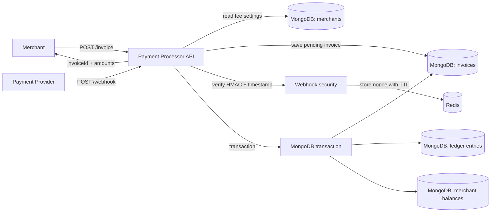
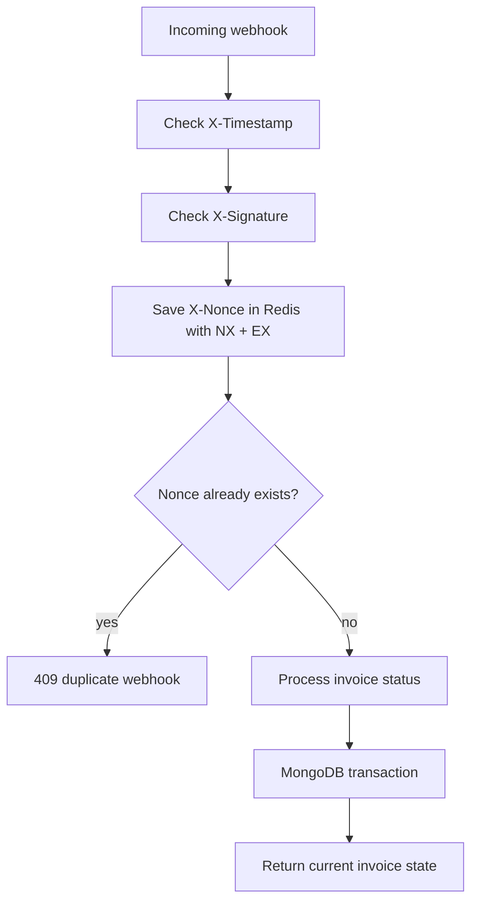

# Payment Processor

A small backend service for payment processing. A merchant creates an invoice, the payment provider later sends a webhook with the payment status, and the backend safely updates the invoice and credits the merchant balance.

## What's Inside 🧰

- Node.js + Express + TypeScript
- MongoDB + Mongoose
- Redis
- Decimal money calculations
- Swagger UI
- Jest coverage 100%

## How It Works 🔁



Main flow:

1. The merchant calls `POST /invoice`.
2. The backend reads the merchant's `feePercent`.
3. It calculates `fee` and `amountToReceive`.
4. It stores the invoice with status `pending`.
5. The payment provider sends `POST /webhook` with status `paid` or `failed`.
6. The backend verifies the signature, timestamp, and nonce.
7. If the status is `paid`, the merchant balance is credited exactly once inside a MongoDB transaction.

## Quick Start 🚀

```bash
npm install
cp .env.example .env
docker compose up -d
npm run seed:merchant
npm run dev
```

After startup:

- API: `http://localhost:3000`
- Swagger UI: `http://localhost:3000/api-docs`
- OpenAPI JSON: `http://localhost:3000/openapi.json`
- Health check: `http://localhost:3000/health`

The `npm run seed:merchant` command creates a test merchant named `merchant-1` with a `2.5%` fee. You can use it right away to test `POST /invoice` in Swagger.

Check Docker services:

```bash
docker compose ps
```

## Environment

The example config is already in `.env.example`:

```env
NODE_ENV=development
HOST=0.0.0.0
PORT=3000
MONGO_URI=mongodb://localhost:27017/payment_processor?replicaSet=rs0
REDIS_URL=redis://localhost:6379
WEBHOOK_SECRET=change-me
WEBHOOK_TIMESTAMP_TOLERANCE_SECONDS=300
```

MongoDB is started as a replica set because MongoDB transactions require a replica set, even in local development.

## API

### POST /invoice

Creates an invoice with status `pending`.

```bash
curl -X POST http://localhost:3000/invoice \
  -H "Content-Type: application/json" \
  -d '{"amount":"100.00","currency":"USD","merchantId":"merchant-1"}'
```

Example response:

```json
{
  "data": {
    "invoiceId": "665f6f1e8b3f3d49e57a6e11",
    "merchantId": "merchant-1",
    "amount": "100.00",
    "currency": "USD",
    "feePercent": "2.5",
    "fee": "2.50",
    "amountToReceive": "97.50",
    "status": "pending"
  }
}
```

### GET /invoice/:id

Returns the current invoice status and calculated amounts.

```bash
curl http://localhost:3000/invoice/665f6f1e8b3f3d49e57a6e11
```

### POST /webhook

Receives a payment status update from the payment provider.

Headers:

- `X-Signature` - HMAC-SHA256 signature of the raw JSON body.
- `X-Timestamp` - Unix timestamp in milliseconds or seconds.
- `X-Nonce` - unique webhook delivery ID.

Body:

```json
{
  "invoiceId": "665f6f1e8b3f3d49e57a6e11",
  "status": "paid"
}
```

Local example with signature generation:

```bash
BODY='{"invoiceId":"665f6f1e8b3f3d49e57a6e11","status":"paid"}'
TIMESTAMP="$(date +%s)000"
NONCE="$(uuidgen)"
SIGNATURE="$(node -e "const crypto=require('crypto'); const body=process.argv[1]; const secret=process.env.WEBHOOK_SECRET || 'change-me'; console.log(crypto.createHmac('sha256', secret).update(body).digest('hex'))" "$BODY")"

curl -X POST http://localhost:3000/webhook \
  -H "Content-Type: application/json" \
  -H "X-Timestamp: $TIMESTAMP" \
  -H "X-Nonce: $NONCE" \
  -H "X-Signature: $SIGNATURE" \
  -d "$BODY"
```

Important: the signature is calculated from the exact JSON string sent in `-d`. If you add spaces or change the field order, recalculate the signature.

## Webhook Security 🔐



The protection has several layers:

- HMAC proves that the body was signed by a trusted payment provider.
- Timestamp limits the lifetime of a webhook request.
- Nonce is stored in Redis for 5 minutes and protects against repeated delivery of the same request.
- Invoice status plus a unique ledger index protect against double crediting.

## Money and Precision 💸

`amount` is sent as a string, for example `"100.00"`. Calculations use `Decimal`, so there are no floating-point rounding surprises.

MongoDB stores money in minor units:

- `amountMinor: "10000"` for `100.00 USD`
- `feeMinor: "250"` for `2.50 USD`
- `amountToReceiveMinor: "9750"` for `97.50 USD`

This makes money safe to store, compare, and add.

## Idempotency ✅

A repeated webhook must not credit money twice.

This project handles that in a few layers:

- Redis nonce rejects the same webhook delivery.
- If an invoice is already `paid` and another `paid` webhook arrives, the backend simply returns the current invoice.
- Ledger entries have a unique `invoiceId`.
- Invoice status, ledger entry, and merchant balance are updated in one MongoDB transaction.

## Where to Look in the Code 🗂️

- `src/routes` - HTTP routes.
- `src/controllers` - HTTP layer: headers/body in, response out.
- `src/services` - business logic.
- `src/models` - Mongoose schemas.
- `src/validators` - Zod validation.
- `src/utils/money.ts` - money calculations and minor units.
- `src/docs/openapi.ts` - Swagger/OpenAPI description.

Most important files:

- `src/services/invoice.service.ts` - invoice creation and lookup.
- `src/services/webhook-security.service.ts` - HMAC, timestamp, nonce.
- `src/services/webhook.service.ts` - transaction, idempotency, balance update.
- `src/models/ledger-entry.model.ts` - unique ledger entry per invoice.

## Tests 🧪

```bash
npm run typecheck
npm test
```

`npm test` runs Jest with coverage. The coverage threshold is set to 100% for statements, branches, functions, and lines.

## Production Build

```bash
npm run build
npm start
```

## Assumptions

- Merchants already exist in the database. For local testing, use `npm run seed:merchant`.
- There is no real payment provider integration; webhooks can be sent through Swagger, curl, or Postman.
- `WEBHOOK_SECRET=change-me` is for local development only.
- The current signature format is simple: HMAC of the raw body. In production, providers often sign `timestamp + nonce + rawBody`.

## What Could Be Improved Next

- Add merchant authentication for `POST /invoice`.
- Use separate webhook secrets for different payment providers.
- Add an audit log for all webhook deliveries.
- Add rate limiting for public endpoints.
