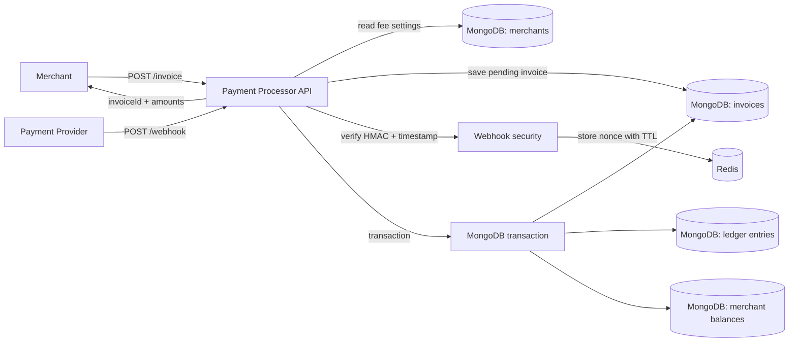
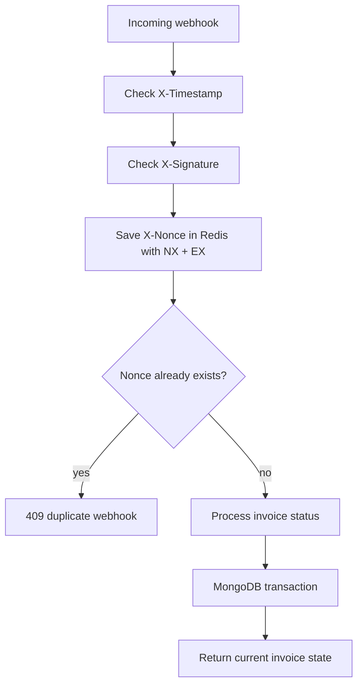

# Payment Processor

Небольшой backend-сервис для приема платежей: мерчант создает invoice, платежная система позже присылает webhook со статусом оплаты, а backend безопасно обновляет статус и зачисляет деньги.

## Что внутри 🧰

- Node.js + Express + TypeScript
- MongoDB + Mongoose
- Redis
- Decimal money calculations
- Swagger UI
- Jest coverage 100%

## Как это работает 🔁



Основной сценарий:

1. Мерчант вызывает `POST /invoice`.
2. Backend берет `feePercent` из настроек мерчанта.
3. Считает `fee` и `amountToReceive`.
4. Сохраняет invoice со статусом `pending`.
5. Платежная система присылает `POST /webhook` со статусом `paid` или `failed`.
6. Backend проверяет подпись, timestamp и nonce.
7. Если статус `paid`, деньги зачисляются один раз через MongoDB transaction.

## Быстрый старт 🚀

```bash
npm install
cp .env.example .env
docker compose up -d
npm run seed:merchant
npm run dev
```

После запуска:

- API: `http://localhost:3000`
- Swagger UI: `http://localhost:3000/api-docs`
- OpenAPI JSON: `http://localhost:3000/openapi.json`
- Health check: `http://localhost:3000/health`

Команда `npm run seed:merchant` создает тестового мерчанта `merchant-1` с комиссией `2.5%`. С ним можно сразу проверять `POST /invoice` в Swagger.

Проверить контейнеры:

```bash
docker compose ps
```

## Environment

Пример уже лежит в `.env.example`:

```env
NODE_ENV=development
HOST=0.0.0.0
PORT=3000
MONGO_URI=mongodb://localhost:27017/payment_processor?replicaSet=rs0
REDIS_URL=redis://localhost:6379
WEBHOOK_SECRET=change-me
WEBHOOK_TIMESTAMP_TOLERANCE_SECONDS=300
```

MongoDB запускается как replica set, потому что MongoDB transactions требуют replica set даже локально.

## API

### POST /invoice

Создает invoice со статусом `pending`.

```bash
curl -X POST http://localhost:3000/invoice \
  -H "Content-Type: application/json" \
  -d '{"amount":"100.00","currency":"USD","merchantId":"merchant-1"}'
```

Пример ответа:

```json
{
  "data": {
    "invoiceId": "665f6f1e8b3f3d49e57a6e11",
    "merchantId": "merchant-1",
    "amount": "100.00",
    "currency": "USD",
    "feePercent": "2.5",
    "fee": "2.50",
    "amountToReceive": "97.50",
    "status": "pending"
  }
}
```

### GET /invoice/:id

Возвращает текущий статус invoice и рассчитанные суммы.

```bash
curl http://localhost:3000/invoice/665f6f1e8b3f3d49e57a6e11
```

### POST /webhook

Принимает статус оплаты от платежной системы.

Headers:

- `X-Signature` - HMAC-SHA256 от raw JSON body.
- `X-Timestamp` - Unix timestamp в миллисекундах или секундах.
- `X-Nonce` - уникальный ID доставки webhook.

Body:

```json
{
  "invoiceId": "665f6f1e8b3f3d49e57a6e11",
  "status": "paid"
}
```

Локальный пример с генерацией подписи:

```bash
BODY='{"invoiceId":"665f6f1e8b3f3d49e57a6e11","status":"paid"}'
TIMESTAMP="$(date +%s)000"
NONCE="$(uuidgen)"
SIGNATURE="$(node -e "const crypto=require('crypto'); const body=process.argv[1]; const secret=process.env.WEBHOOK_SECRET || 'change-me'; console.log(crypto.createHmac('sha256', secret).update(body).digest('hex'))" "$BODY")"

curl -X POST http://localhost:3000/webhook \
  -H "Content-Type: application/json" \
  -H "X-Timestamp: $TIMESTAMP" \
  -H "X-Nonce: $NONCE" \
  -H "X-Signature: $SIGNATURE" \
  -d "$BODY"
```

Важно: подпись считается именно от того JSON, который отправляется в `-d`. Если добавить пробелы или поменять порядок полей, подпись нужно пересчитать.

## Webhook security 🔐



Защита устроена так:

- HMAC-подпись доказывает, что body пришел от доверенной платежной системы.
- Timestamp ограничивает время жизни webhook.
- Nonce хранится в Redis 5 минут и защищает от повторной доставки того же запроса.
- Invoice status + ledger unique index защищают от повторного зачисления денег.

## Деньги и точность 💸

`amount` приходит строкой, например `"100.00"`. Внутри расчет идет через `Decimal`, без floating-point ошибок.

В MongoDB суммы сохраняются в minor units:

- `amountMinor: "10000"` для `100.00 USD`
- `feeMinor: "250"` для `2.50 USD`
- `amountToReceiveMinor: "9750"` для `97.50 USD`

Так проще безопасно складывать, сравнивать и хранить деньги.

## Идемпотентность ✅

Повторный webhook не должен начислять деньги второй раз.

В проекте это сделано в несколько слоев:

- Redis nonce отклоняет одинаковую доставку webhook.
- Если invoice уже `paid` и снова приходит `paid`, backend просто возвращает текущий invoice.
- Ledger entry имеет уникальный `invoiceId`.
- Статус invoice, ledger entry и balance обновляются в одной MongoDB transaction.

## Где смотреть код 🗂️

- `src/routes` - HTTP routes.
- `src/controllers` - HTTP layer: headers/body in, response out.
- `src/services` - бизнес-логика.
- `src/models` - Mongoose schemas.
- `src/validators` - Zod validation.
- `src/utils/money.ts` - расчет денег и minor units.
- `src/docs/openapi.ts` - Swagger/OpenAPI описание.

Самые важные файлы:

- `src/services/invoice.service.ts` - создание и получение invoice.
- `src/services/webhook-security.service.ts` - HMAC, timestamp, nonce.
- `src/services/webhook.service.ts` - transaction, idempotency, balance update.
- `src/models/ledger-entry.model.ts` - уникальная ledger-запись на invoice.

## Тесты 🧪

```bash
npm run typecheck
npm test
```

`npm test` запускает Jest с coverage. Порог покрытия настроен на 100% для statements, branches, functions и lines.

## Production build

```bash
npm run build
npm start
```

## Допущения

- Мерчанты уже существуют в базе. Для локальной проверки есть `npm run seed:merchant`.
- Реальной интеграции с платежной системой нет, webhook можно отправлять через Swagger, curl или Postman.
- `WEBHOOK_SECRET=change-me` подходит только для локального запуска.
- Формат подписи сейчас простой: HMAC от raw body. В production часто подписывают `timestamp + nonce + rawBody`.

## Что можно улучшить дальше

- Добавить merchant authentication для `POST /invoice`.
- Завести отдельные секреты webhook для разных платежных провайдеров.
- Добавить audit log для всех webhook-доставок.
- Добавить rate limit на публичные endpoints.
